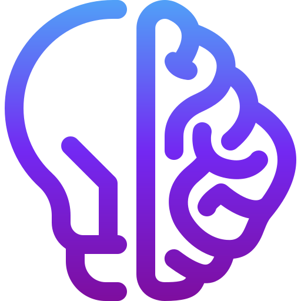

<!-- HEADER: Logo and Title Centered -->

  

<h1 align="center">next-mind-deep-research</h1>

<!-- SVG Wave Divider (Header) -->

  <svg width="100%" height="40" viewBox="0 0 1200 40" fill="none" xmlns="http://www.w3.org/2000/svg">
    <path d="M0 0H1200V40C900 20 300 60 0 40V0Z" fill="#06b6d4"/>
  </svg>

  
  
  

<!-- BADGES: Status & Community -->

  
  
  
  

<!-- BADGES: Quality & Tech -->

  
  
  
  
  
  

<!-- BADGES: Motivasi & Open Source -->

  
  

<!-- FULL WIDTH: Description (no background) -->

  <h2 align="center">Deskripsi Singkat</h2>
  

    <b>next-mind-deep-research</b> adalah platform riset berbasis Next.js untuk eksplorasi dan pengembangan teknologi AI, data science, dan deep learning secara kolaboratif dan terstruktur. Proyek ini dikembangkan oleh <b>Eliyanto Sarage</b> dan bertujuan menjadi fondasi modern yang scalable untuk tim riset, engineer, maupun komunitas open-source yang ingin membangun solusi inovatif, melakukan eksperimen, serta berbagi hasil penelitian secara efisien.
  

<!-- Table of Content Centered -->
<h2 align="center">Table of Content</h2>

  <a href="#fitur-utama">Fitur Utama</a> ·
  <a href="#demo--screenshot">Demo / Screenshot</a> ·
  <a href="#getting-started">Getting Started</a> ·
  <a href="#penggunaan">Penggunaan</a> ·
  <a href="#struktur-proyek">Struktur Proyek</a> ·
  <a href="#teknologi--dependency">Teknologi & Dependency</a> ·
  <a href="#konfigurasi">Konfigurasi</a> ·
  <a href="#testing">Testing</a> ·
  <a href="#deployment">Deployment</a> ·
  <a href="#kontribusi">Kontribusi</a> ·
  <a href="#roadmap">Roadmap</a> ·
  <a href="#faq">FAQ</a> ·
  <a href="#masalah--dukungan">Masalah & Dukungan</a> ·
  <a href="#lisensi">Lisensi</a> ·
  <a href="#kredit--kontributor">Kredit & Kontributor</a> ·
  <a href="#referensi">Referensi</a>

<!-- SVG Dots Divider Before Fitur Utama -->

  <svg width="100" height="10"><circle cx="10" cy="5" r="5" fill="#3b82f6"/><circle cx="30" cy="5" r="5" fill="#06b6d4"/><circle cx="50" cy="5" r="5" fill="#6366f1"/><circle cx="70" cy="5" r="5" fill="#0ea5e9"/><circle cx="90" cy="5" r="5" fill="#a21caf"/></svg>

<!-- FULL WIDTH: Fitur Utama (no background, no max-width) -->

<h2 align="center">Fitur Utama</h2>
<ul>
  <li><b>Arsitektur Modular & Scalable:</b> Setiap modul dapat dikembangkan secara terpisah, memungkinkan pengembangan fitur baru tanpa mengganggu sistem utama.</li>
  <li><b>Integrasi Pipeline AI/ML:</b> Mendukung pembuatan, pelatihan, dan evaluasi model machine learning secara visual maupun kode.</li>
  <li><b>Dokumentasi Otomatis & Testing Terintegrasi:</b> Setiap perubahan kode dapat langsung didokumentasikan dan diuji secara otomatis untuk menjaga kualitas proyek.</li>
  <li><b>Dukungan CI/CD:</b> Proses build, test, dan deployment berjalan otomatis melalui GitHub Actions untuk memastikan update selalu stabil.</li>
  <li><b>Kolaborasi Multi-user:</b> Mendukung kolaborasi tim lintas disiplin dengan sistem permission dan workflow yang fleksibel.</li>
  <li><b>Integrasi Dataset & Visualisasi:</b> Mudah mengimpor dataset serta menampilkan visualisasi hasil eksperimen secara interaktif.</li>
  <li><b>Customizable:</b> Dapat diintegrasikan dengan library eksternal atau API pihak ketiga untuk memperluas fungsionalitas.</li>
</ul>

<!-- Demo Centered (no max-width) -->
<h2 align="center">Demo / Screenshot</h2>

  

  <i>Contoh tampilan pipeline AI, visualisasi data, dan dashboard kolaborasi next-mind-deep-research.</i>

<!-- SVG Dots Divider Before Getting Started -->

  <svg width="100" height="10"><circle cx="10" cy="5" r="5" fill="#3b82f6"/><circle cx="30" cy="5" r="5" fill="#06b6d4"/><circle cx="50" cy="5" r="5" fill="#6366f1"/><circle cx="70" cy="5" r="5" fill="#0ea5e9"/><circle cx="90" cy="5" r="5" fill="#a21caf"/></svg>

<!-- Getting Started Full Width (no background, no max-width) -->

<h2 align="center">Getting Started</h2>
<h3>Prasyarat</h3>
<ul>
  <li>Node.js >= 18</li>
  <li>npm >= 9</li>
  <li>Git</li>
</ul>
<h3>Instalasi</h3>
<ol>
  <li>Clone repository: <pre><code>git clone https://github.com/idugeni/next-mind-deep-research.git</code></pre></li>
  <li>Masuk ke folder proyek: <pre><code>cd next-mind-deep-research</code></pre></li>
  <li>Install dependencies: <pre><code>npm install</code></pre></li>
</ol>
<h3>Cara Menjalankan</h3>
<b>Development</b>
<pre><code>npm run dev</code></pre>
Akses aplikasi di <a href="http://localhost:3000">http://localhost:3000</a> melalui browser.

<b>Production</b>
<pre><code>npm run build
npm start</code></pre>
Aplikasi akan berjalan secara optimal di lingkungan produksi.

<b>Lint</b>
<pre><code>npm run lint</code></pre>

<b>Cek Tipe TypeScript</b>
<pre><code>npm run check-types</code></pre>

<!-- Penggunaan Centered (no max-width) -->
<h2 align="center">Penggunaan</h2>
<ul>
  <li><b>Menjalankan pipeline AI:</b> Buat, jalankan, dan evaluasi pipeline machine learning langsung dari UI atau melalui API.</li>
  <li><b>Manajemen Dataset:</b> Upload, kelola, dan gunakan dataset untuk eksperimen maupun produksi.</li>
  <li><b>Visualisasi Hasil:</b> Tampilkan grafik, metrik, dan insight dari hasil training atau evaluasi model.</li>
  <li><b>Kolaborasi Tim:</b> Tambah anggota tim, atur peran, dan pantau kontribusi masing-masing user.</li>
  <li><b>Integrasi Eksternal:</b> Hubungkan dengan layanan cloud, API, atau library lain untuk memperluas fungsionalitas.</li>
</ul>
<h3 align="center">Studi Kasus</h3>
<ul>
  <li><b>Penelitian Model Klasifikasi Gambar:</b> Mengembangkan model deep learning untuk klasifikasi citra medis dengan pipeline yang terdokumentasi.</li>
  <li><b>Riset Natural Language Processing:</b> Kolaborasi tim dalam membangun dan membandingkan model NLP untuk analisis sentimen.</li>
  <li><b>Eksperimen Data Science:</b> Menguji berbagai algoritma machine learning pada dataset publik dan membagikan insight ke komunitas.</li>
</ul>

<!-- Struktur Proyek Full Width (no background, no max-width) -->

<h2 align="center">Struktur Proyek</h2>
<pre><code>next-mind-deep-research/
├── src/
│   ├── app/           # Source code utama Next.js (routing, API, dsb)
│   ├── components/    # Reusable React components (UI/UX modular)
│   ├── lib/           # Library, helper, dan utilitas
│   └── ...
├── public/            # Static assets (logo, gambar, favicon, dsb)
├── docs/              # Dokumentasi tambahan (panduan, tutorial, dsb)
├── .github/           # Workflow CI/CD dan issue templates
├── package.json       # Konfigurasi dependencies dan script npm
└── README.md          # Dokumentasi utama proyek
</code></pre>

<!-- Teknologi & Dependency Centered (no max-width) -->
<h2 align="center">Teknologi & Dependency</h2>
<ul>
  <li><b>Next.js</b> (v15.3.1): Framework React modern untuk SSR, SSG, dan API routes.</li>
  <li><b>React</b> (v19): Library UI berbasis komponen.</li>
  <li><b>TypeScript</b> (v5.8.3): Superset JavaScript untuk penulisan kode yang lebih aman dan maintainable.</li>
  <li><b>Tailwind CSS</b> (v4.1.4): Utility-first CSS framework untuk styling yang konsisten dan efisien.</li>
  <li><b>Jest & Testing Library</b>: Untuk unit, integration, dan end-to-end testing.</li>
  <li><b>GitHub Actions</b>: CI/CD otomatis untuk build, test, dan deployment.</li>
  <li><b>ESLint & Prettier</b>: Menjaga kualitas dan konsistensi kode.</li>
  <li><b>Radix UI, Zod, Axios, dll</b>: Dependency lain dapat dilihat di <code>package.json</code>.</li>
</ul>

<!-- Konfigurasi Full Width (no background, no max-width) -->

<h2 align="center">Konfigurasi</h2>
<ul>
  <li>Buat file <code>.env</code> di root proyek untuk menyimpan environment variables (lihat contoh di <code>.env.example</code>).</li>
  <li>Atur variabel seperti <code>DATABASE_URL</code>, <code>API_KEY</code>, dan konfigurasi lain sesuai kebutuhan deployment Anda.</li>
  <li>Pastikan variabel sensitif tidak di-commit ke repository publik.</li>
</ul>

<!-- Testing Centered (no max-width) -->
<h2 align="center">Testing</h2>

  Proyek ini dilengkapi dengan testing otomatis untuk memastikan setiap perubahan kode tidak merusak fitur yang sudah ada. Gunakan perintah berikut untuk menjalankan seluruh test:

<pre><code>npm run test</code></pre>

  Coverage report akan dihasilkan secara otomatis pada setiap push ke branch utama. Anda juga dapat menambahkan test baru sesuai kebutuhan modul.

<!-- Deployment Centered (no max-width) -->
<h2 align="center">Deployment</h2>
<ul>
  <li><b>Manual:</b> Deploy ke layanan seperti Vercel, Netlify, atau server pribadi dengan mengikuti panduan Next.js deployment.</li>
  <li><b>Otomatis:</b> Setiap push ke branch utama akan memicu workflow CI/CD (GitHub Actions) untuk build dan deploy otomatis ke staging/production.</li>
  <li><b>Custom Domain & Environment:</b> Dukungan untuk custom domain, environment variables, dan scaling sesuai kebutuhan produksi.</li>
</ul>

<!-- SVG Dots Divider Before Footer -->

  <svg width="100" height="10"><circle cx="10" cy="5" r="5" fill="#3b82f6"/><circle cx="30" cy="5" r="5" fill="#06b6d4"/><circle cx="50" cy="5" r="5" fill="#6366f1"/><circle cx="70" cy="5" r="5" fill="#0ea5e9"/><circle cx="90" cy="5" r="5" fill="#a21caf"/></svg>

<!-- Kontribusi Full Width (no background, no max-width) -->

<h2 align="center">Kontribusi</h2>

  Kontribusi sangat terbuka untuk siapa saja! Silakan baca <a href="CONTRIBUTING.md">CONTRIBUTING.md</a> untuk panduan kontribusi, standar kode, dan proses pull request. Pastikan untuk mengikuti <b>Code of Conduct</b> dan menjaga kolaborasi yang sehat.

<!-- Roadmap Centered (no max-width) -->
<h2 align="center">Roadmap</h2>
<ul>
  <li>[x] Setup Next.js dan struktur proyek dasar</li>
  <li>[x] Integrasi pipeline AI/ML sederhana</li>
  <li>[x] Implementasi dokumentasi otomatis dan testing</li>
  <li>[ ] Modul visualisasi lanjutan untuk data dan hasil training</li>
  <li>[ ] Integrasi data eksternal dan API pihak ketiga</li>
  <li>[ ] Sistem notifikasi dan kolaborasi real-time</li>
  <li>[ ] Fitur monitoring dan logging eksperimen</li>
</ul>

<!-- FAQ Centered (no max-width) -->
<h2 align="center">FAQ</h2>

<b>Q:</b> Bagaimana cara menambah modul atau fitur baru? 
<b>A:</b> Ikuti panduan di <code>docs/development.md</code> dan pastikan menulis test serta dokumentasi.

<b>Q:</b> Apakah bisa di-deploy di cloud atau server sendiri? 
<b>A:</b> Ya, platform ini mendukung deployment di Vercel, Netlify, maupun server pribadi.

<b>Q:</b> Apakah bisa digunakan untuk riset kolaboratif multi-user? 
<b>A:</b> Sangat bisa! Sistem permission dan workflow mendukung kolaborasi tim lintas disiplin.

<!-- Masalah & Dukungan Full Width (no background, no max-width) -->

<h2 align="center">Masalah & Dukungan</h2>

  Jika menemukan bug, kendala teknis, atau ingin request fitur, silakan buat <a href="https://github.com/idugeni/next-mind-deep-research/issues">issue baru di GitHub</a> atau hubungi maintainer melalui email: <a href="mailto:officialelsa21@gmail.com">officialelsa21@gmail.com</a>. Kami sangat menghargai feedback dan kontribusi Anda!

<!-- Lisensi Centered (no max-width) -->
<h2 align="center">Lisensi</h2>

  Proyek ini berlisensi <b>MIT License</b>. Anda bebas menggunakan, memodifikasi, dan mendistribusikan ulang proyek ini dengan tetap mencantumkan atribusi kepada pembuat asli. Lihat detail di <a href="LICENSE">LICENSE</a>.

<!-- Kredit & Kontributor Full Width (no background, no max-width) -->

<h2 align="center">Kredit & Kontributor</h2>
<ul>
  <li><a href="https://github.com/idugeni">Eliyanto Sarage</a> (Maintainer, Lead Developer)</li>
  <li>Kontributor komunitas, reviewer, dan semua pihak yang telah membantu pengembangan proyek ini. Lihat daftar lengkap di <a href="https://github.com/idugeni/next-mind-deep-research/graphs/contributors">GitHub Contributors</a>.</li>
</ul>

<!-- Referensi Centered (no max-width) -->
<h2 align="center">Referensi</h2>
<ul>
  <li><a href="https://nextjs.org/docs">Next.js Documentation</a> — Panduan lengkap framework utama proyek.</li>
  <li><a href="https://vercel.com/docs">Vercel Deployment</a> — Dokumentasi deployment modern untuk Next.js.</li>
  <li><a href="https://docs.github.com/en/actions">GitHub Actions</a> — Otomasi CI/CD dan workflow.</li>
  <li><a href="https://react.dev/">React Official Docs</a> — Dasar pengembangan UI berbasis komponen.</li>
  <li><a href="https://www.typescriptlang.org/docs/">TypeScript Docs</a> — Penulisan kode yang lebih aman dan scalable.</li>
  <li><a href="https://tailwindcss.com/docs">Tailwind CSS Docs</a> — Utility-first CSS framework.</li>
</ul>

<!-- Stylish Footer Effect: SVG Wave -->

  <svg width="100%" height="60" viewBox="0 0 1200 60" fill="none" xmlns="http://www.w3.org/2000/svg">
    <path d="M0 0H1200V60C800 40 400 80 0 60V0Z" fill="#3b82f6"/>
  </svg>
   
  
    <b>Made with ❤️ by Eliyanto Sarage & Contributors</b> 
    Powered by <a href="https://nextjs.org/">Next.js</a> &middot; <a href="https://vercel.com/">Vercel</a>
  

